# ADF CI/CD Pipelines

1.  GitHub Integration

2.  Infrastructure

3.  Preparing for ADF Integration

4.  Deploy with Release Pipeline

CI/CD Workflow:
===============

1.  Work on new feature branch

2.  Test

    Integrate in collaboration branch.

3.  Push to qa Environment

4.  Test stg Environment

5.  Push to production Environment.

Infrastructure
==============

Thoughtfully consider a naming strategy:

Example **{bg}-{projName}-{component}-{environment}**

\-Create for each environment (dev, qa, prod)

>   1. Azure Resource Group

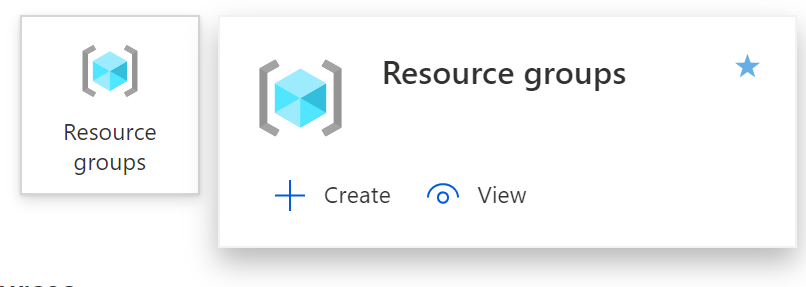

Following the suggestion, the resource group is given the name

**mm-proj1-rg-dev**

**mm-proj1-rg-qa**

**mm-proj1-rg-prod**

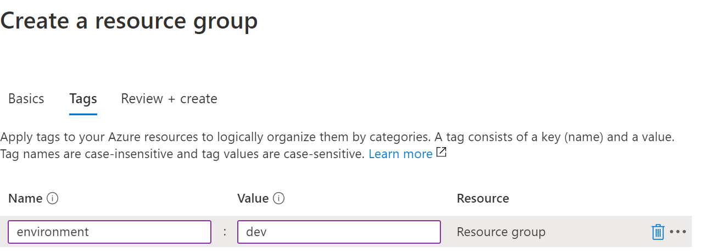

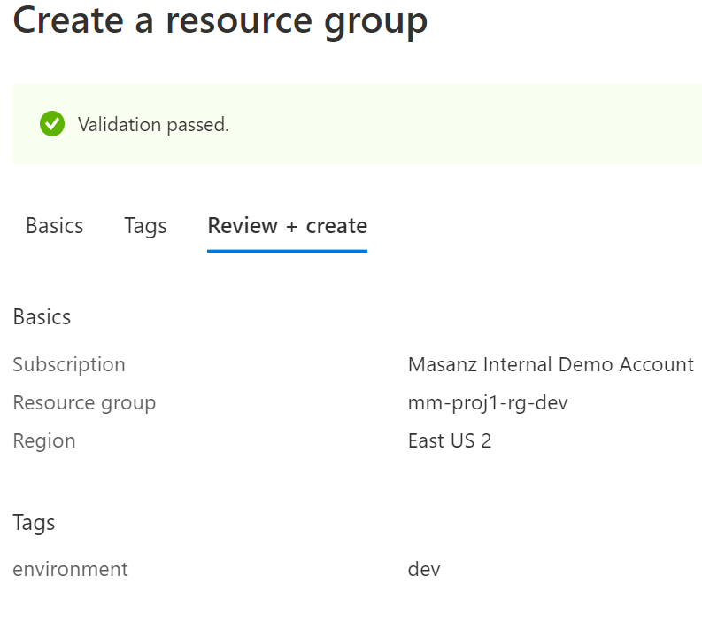

>   Finally Click on the Create Button

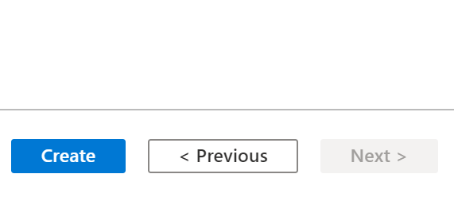

>   2. Azure Data Factory

>   Create a new resource searching for ‘Data Factory’

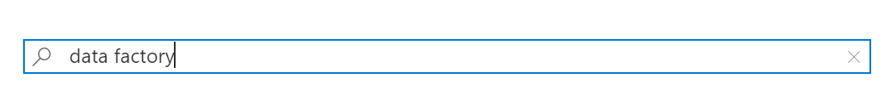

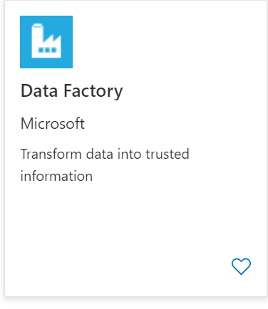

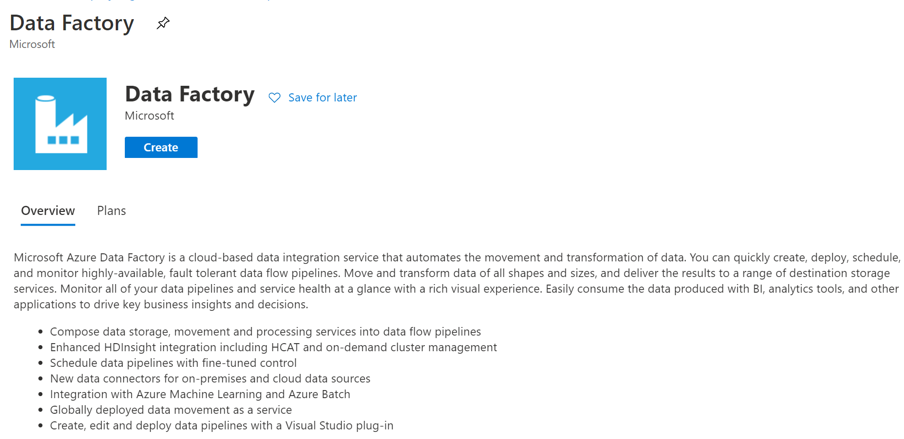

>   Provide with name following convention

>   mm-proj1-adf-dev, carefully select the correct region

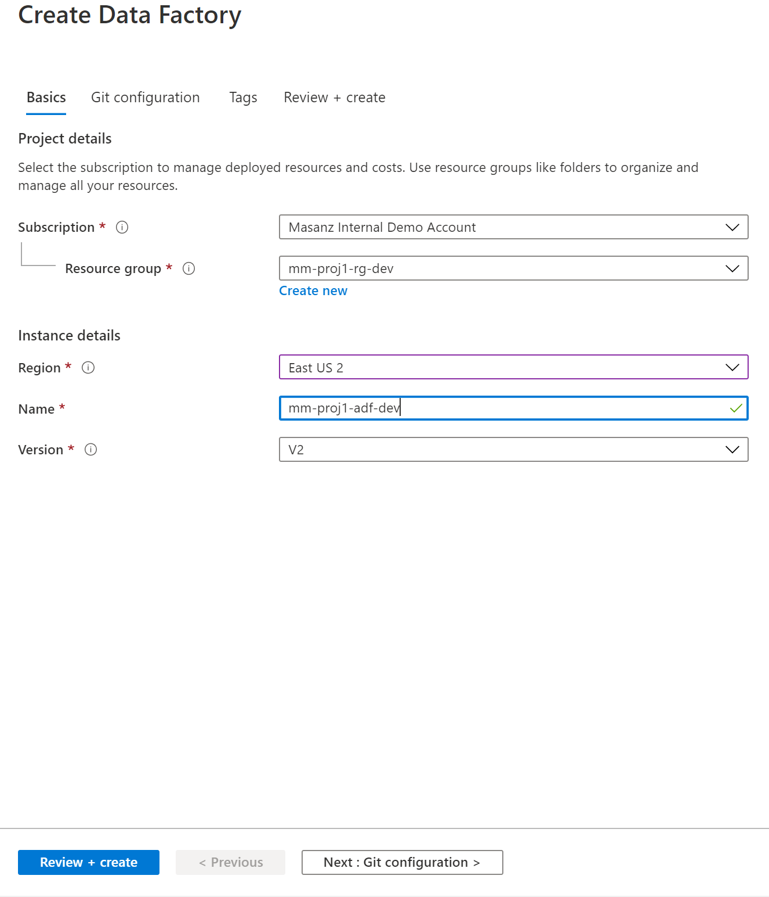

>   Move onto the ‘Git configuraiton’

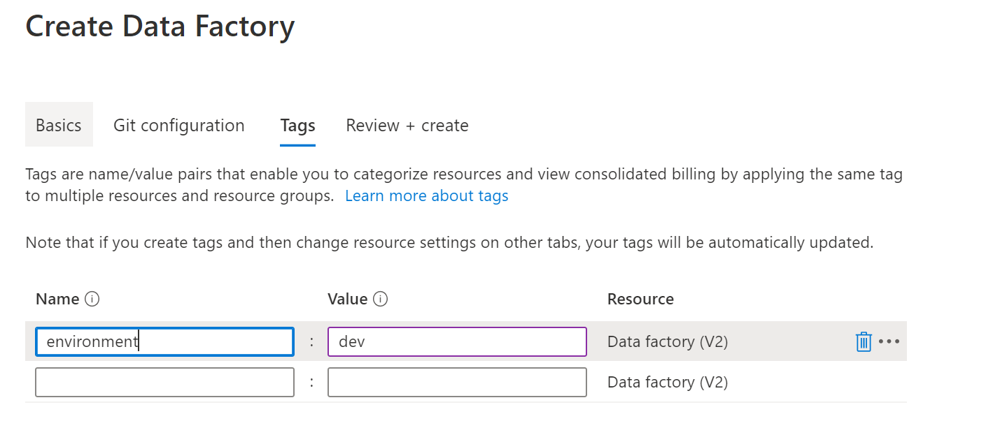

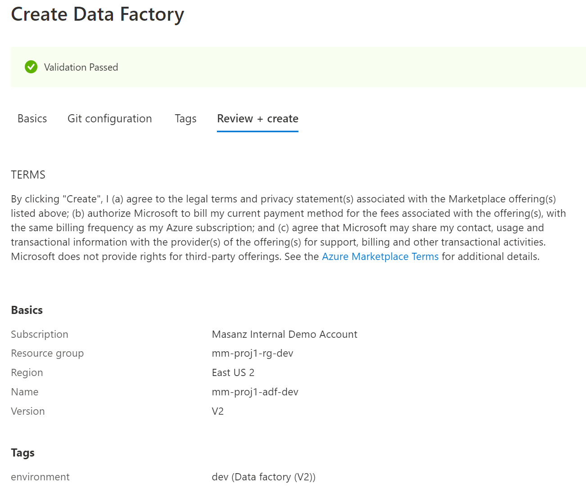

1.  Azure Key Vault

    **mm-proj1-kv-dev**

    **mm-proj1-kv-qa**

    **mm-proj1-kv-prod**

    Search for Key Vault

    

    

    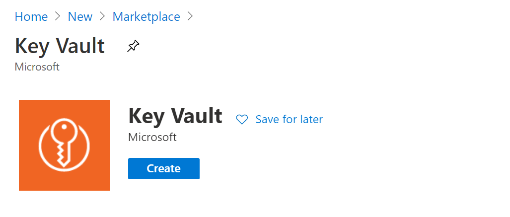

    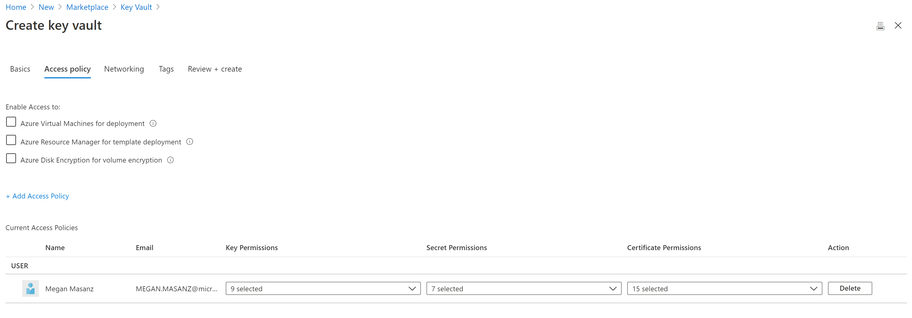

    

    

    

2.  Create Azure Storage Account

    mmxproj1xstordev

    mmxproj1xstorqa

    mmxproj1xstorprod

    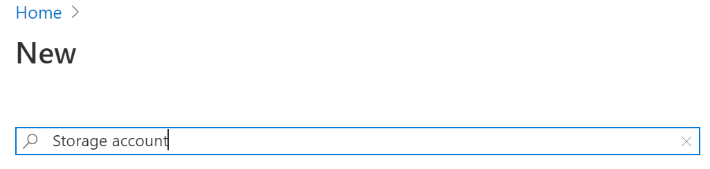

    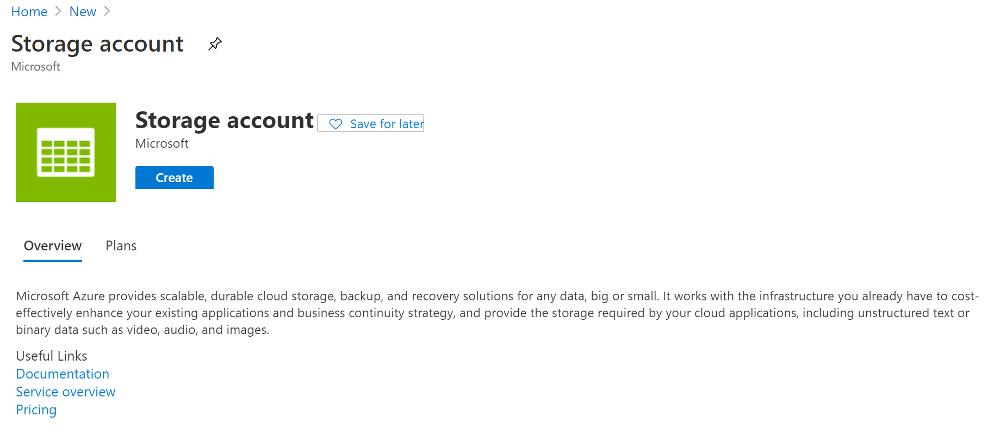

    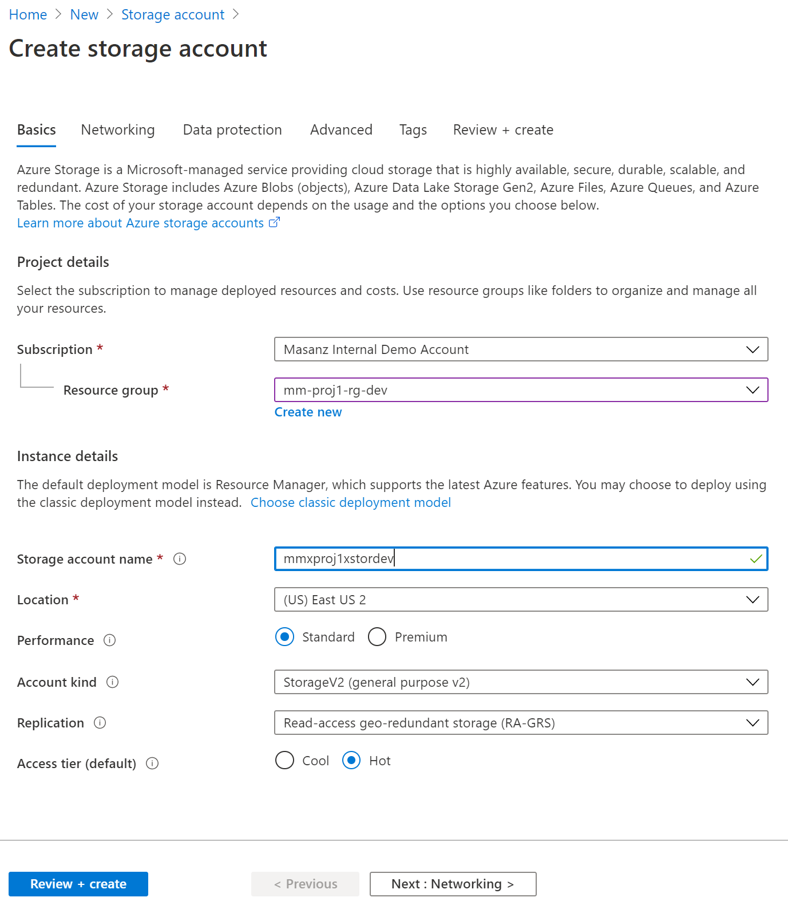

3.  Create Containers inside Storage Account ‘datasource’ & ‘datadest’

    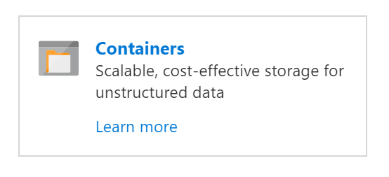

    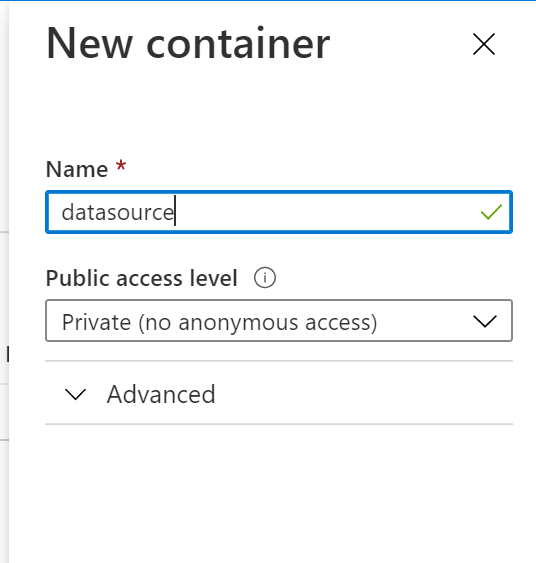

    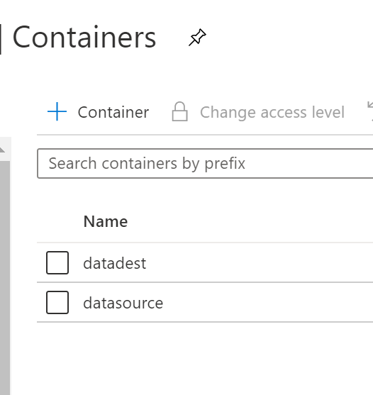

Preparing for ADF Integration
=============================

Key vault will store your sensitive information, like connection strings. Go to
storage account and copy the Access key

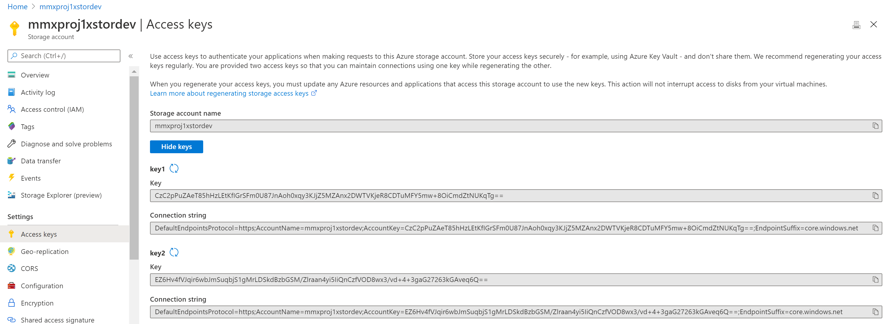

\-Azure DevOps Project:
