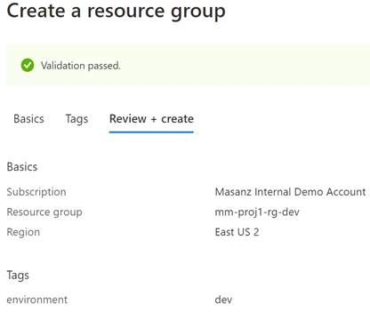
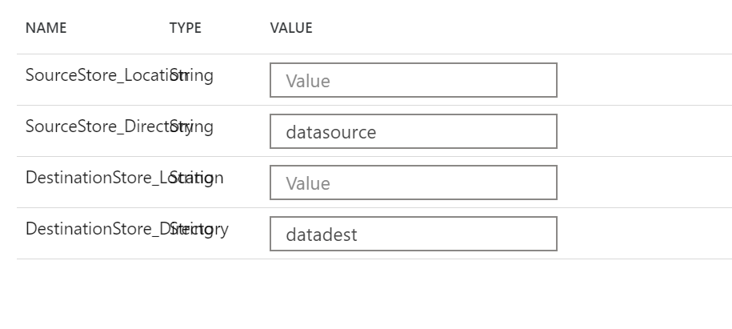
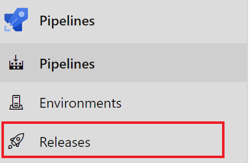
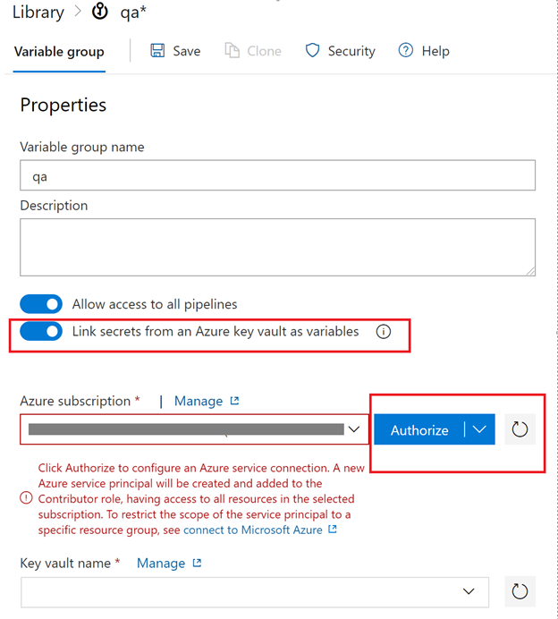
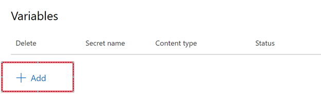

Azure Data Factory CI/CD Pipeline Hack
=======

Pre-Reqs:
---------
Need to have ability to create service principal.

Review:
---------
### 1. CI/CD Workflow
### 2. Setup Infrastructure
### 3. Preparing for ADF Integration (setting up key vault)
### 4. Creating a pipeline from a template
### 5. Azure DevOps Setup
### 6. Azure Data Factory Link to Azure DevOps
### 7. Deploying with a Release Pipeline


## CI/CD Workflow
--------------------------------------------
1. Work on a new feature branch
2. Test
3. Integrate in collaboration branch
4. Push to QA environment
5. Test in QA environment
6. Approve moving to production


## 2. Setup Infrastructure
--------------------------------------------


Thoughtfully consider a naming strategy

Ex: 
```
{bg}-{projName}-{component}-{environment}
```
### 2.1 Setup Resource groups

| Resource Group Names for Example: |
|--------------------------|
| mm-proj1-rg-dev          |
| mm-proj1-rg-qa           |
| mm-proj1-rg-prod         |


For each environment [dev, qa, prod] we are going to create resources.  




Finally Create the `Create` Button.


### 2.2 Azure Data Factory
--------------------------------------------

Create a new resource searching for `Data Factory`.  Technically, the pipeline would be able to create the qa and prod environments for us, but we do need to link the qa and prod environments to our key vault, so we will go ahead and create them manually to make sure we can provide them with the correct permissions.

| ADF Names for Example: |
|--------------------------|
| mm-proj1-adf-dev         |
| mm-proj1-adf-qa          |
| mm-proj1-adf-prod        |


Move onto the `Git configuration`


### 2.3 Azure Key Vault
--------------------------------------------

Lets create 3 Azure Key Vaults

| Azure Key Vaults:       |
|-------------------------|
| mm-proj1-kv-dev         |
| mm-proj1-kv-qa          |
| mm-proj1-kv-prod        |


### 2.4 Azure Storage Accounts
--------------------------------------------

| Azure Storage Account:   |
|--------------------------|
| mmxproj1xstordev         |
| mmxproj1xstordqa         |
| mmxproj1xstordprod       |


### 2.5 Azure Storage Accounts Containers
--------------------------------------------

Create containers inside storage account `datasource` & `datadest`


## 3. Preparing for ADF Integration (setting up key vault)
--------------------------------------------

We need to setup the key-vault connection string & ADF Key Vault Access.

3.1 Key vault will store your sensitive information, like connection strings.  Go to storage account and copy the Access key we will store it in a variable called ‘blob-connection’

In each key vault create a blob storage connection string.  Go to the dev instance of your storage account and grab the key from `Access keys`


In each key vault create an environment variable


3.2 Setup MSI Key Vault Access


## 4. Creating a pipeline from a template
--------------------------------------------

In the dev instance click on the `Author & Monitor` Button


Selecting a new DataSourceConnection we are able to create a new linked service.


Swap over to Azure Key Vault and we will create a linked service for Azure Key Vault as well.


After selecting the `create` button 


Let all 3 use the same linked service.


Then select `use this template`


Recall that we created storage containers in each of our environments, lets add them to the parameters inside the ADF pipeline we just created from the template


Validate & Publish


If we want, we can go to the storage explorer & view the storage accounts


Clicking debug on the pipeline


Clicking on the refresh we can see that it has completed.


#### Create a trigger





### 5. Azure DevOps Setup
--------------------------------------------

DevOps Organizations
Great resource to check out & Plan Yoour organziational structure

<https://docs.microsoft.com/en-us/azure/devops/user-guide/plan-your-azure-devops-org-structure?toc=%2Fazure%2Fdevops%2Forganizations%2Ftoc.json&bc=%2Fazure%2Fdevops%2Forganizations%2Fbreadcrumb%2Ftoc.json&view=azure-devops>


Ideally – you would add your project to an existing DevOps organization.  So let’s check what you currently have.

Create a new organization if we need to.  This would be a follow up to determine if there is a central team to work with.


Then create a project


Click on the `Create project` button


<http://dev.azure.com/>

Setup Users

Users need to be added to the organization & to the project


### 6. Azure Data Factory Link to Azure DevOps
--------------------------------------------
Let’s head back to ADF and setup the link to our newly created project.


Let’s check back at the repo.  We currently only have a master branch.


Going back into ADF we can select the ‘Publish’
On the collaboration branch ‘master’ when we publish we are generating the adf_publish branch


Going back into devOps project we can see the **adf_publish** branch, but it’s empty.  The first time we need to make an arbituary change to generate the full **adf_publish** branch.

Below is changing the description on the master branch and then publishing


After that – checking the **adf_publish(( branch will have the code.


However, it is empty.


Create a Release Pipeline



Select an Empty Job


Rename the Stage to `QA`, close it with the X and rename the `New release pipeline` to `ADF-Release-Pipeline`


Don't forget to hit the `Save` button.


We will go and create some variable groups

Create variable groups





Next we will add the variables from key vault.


Then save the variable group


Create Prod Variable Group and Authorize


#### Then Add the prod variables




Now that we have the variable groups to use in the release pipeline we will go ahead and set them up.  

Let’s go back into the releases


#### Setting up deployment Variables

Looking at the adf_publish branch you can see several variables.


`factoryName` is a pipeline variable


#### Setting up the 


Click the `Add` button


#### Linking Variable Groups

Link qa to QA Stage


Add another task


Click the `Add` Button


Select the template and template parameter files


Override the factoryName with $(factoryName)


Make sure you select **Incremental**


We need to disable and enable triggers in the adf_publish branch.  We can add the script to the adf_publish branch.

https://docs.microsoft.com/en-us/azure/data-factory/continuous-integration-deployment#script

https://github.com/memasanz/ADFCICID/blob/master/powershellscript/disabletrigger.ps1


So now we can add an Azure Power Shell task to the release pipeline


```
-armTemplate $(System.DefaultWorkingDirectory)/_mm-data-team-adf-integration/mm-proj1-adf-dev/ARMTemplateForFactory.json -ResourceGroupName mm-proj1-rg-$(Environment) -DataFactoryName $(factoryName) -predeployment $true -deleteDeployment $false
```


In the post deploy task, update the ‘predeployment’ to be false, and the ‘deleteDeployment’ to be true, it will remove unused resources from ADF (like linked services etc).


Save and clone the QA to create prod


Now that we have cloned the production we will need to manage our variable groups


Change the scope of qa to only be for QA
Then Save

Almost Done. Confirm in key vaults that for stage and prod that the service connection has proper access.


#### Setup continuous integration:


Set pre-deployment for prod & Save


#### ADF Workflow


So now let’s make some changes.
Create a branch, make a change, create a pull request, get it approved, merged and then you need to publish to see the change.
Inside dev instance of ADF let’s create a branch


Approve & Complete


Switch back to Master branch in ADF


You cna debug here

Hit the publish button


